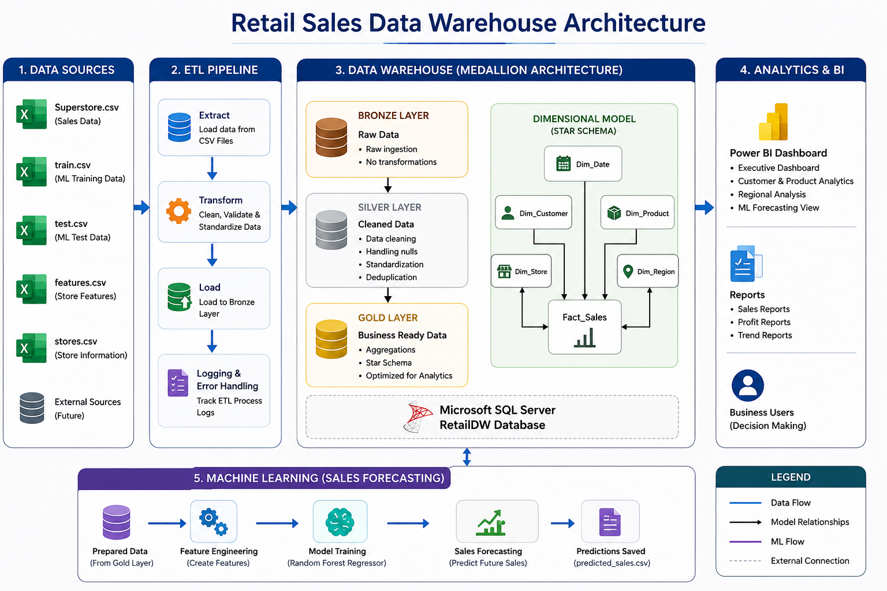

Retail Sales Data Warehouse with Machine Learning-Based Demand Forecasting
## 📖 About the Project

The **Retail Sales Data Warehouse with Machine Learning-Based Demand Forecasting** is an end-to-end data engineering and analytics project that transforms raw retail sales data into meaningful business insights and future sales predictions.

The project follows the **Medallion Architecture (Bronze, Silver, and Gold)** to build a scalable data warehouse using **Microsoft SQL Server**. Raw retail datasets are extracted from CSV files, cleaned and transformed through Python-based ETL pipelines, and modeled into an **Enterprise Star Schema** for efficient reporting and analytics.

Interactive dashboards are developed in **Microsoft Power BI** to visualize key business metrics, including sales performance, customer behavior, product analysis, and regional trends. Additionally, a **Random Forest Regression** machine learning model is implemented to forecast future weekly sales, enabling data-driven business decisions.

This project demonstrates practical implementation of **Data Engineering, ETL Pipelines, Data Warehousing, Business Intelligence, SQL Development, and Machine Learning**, making it a comprehensive portfolio project for aspiring Data Engineers and Data Analysts.

---
## 🏗️ Project Architecture

The **Retail Sales Data Warehouse with Machine Learning-Based Demand Forecasting** follows a modern end-to-end data engineering architecture that integrates data ingestion, ETL processing, data warehousing, business intelligence, and machine learning to support data-driven business decisions.

The architecture begins with retail sales datasets collected from the **Global Superstore** and **Walmart Sales Forecast** datasets in CSV format. A Python-based ETL pipeline extracts, cleans, transforms, and loads the data into a SQL Server data warehouse following the **Medallion Architecture**

<p align="center">
  
</p>
The data warehouse is organized into three layers:
- **Bronze Layer** stores raw data exactly as received from the source systems.
- **Silver Layer** performs data cleansing, validation, standardization, and transformation to improve data quality.
- **Gold Layer** contains business-ready data modeled as an **Enterprise Star Schema** with fact and dimension tables optimized for analytics and reporting.

The processed data is then utilized by two major components:

- **Power BI Dashboards** provide interactive visualizations for executive reporting, customer and product analytics, regional sales analysis, and business performance monitoring.
- **Machine Learning Pipeline** applies a Random Forest Regression model to preprocess data, train and evaluate the model, and generate future weekly sales forecasts.

This architecture enables efficient data processing, scalable analytics, accurate forecasting, and meaningful business insights, supporting strategic decision-making across retail operations.
---
## 📖 Project Overview

The **Retail Sales Data Warehouse with Machine Learning-Based Demand Forecasting** is an end-to-end Data Engineering, Business Intelligence, and Machine Learning project developed to transform raw retail sales data into meaningful business insights and accurate sales forecasts.

The project implements a modern **Medallion Architecture (Bronze, Silver, and Gold)** using **Microsoft SQL Server** to build a scalable and enterprise-ready data warehouse. Raw retail datasets are extracted from CSV files, processed through Python-based ETL pipelines, and transformed into a well-structured **Enterprise Star Schema** optimized for analytical reporting.

Interactive dashboards are developed using **Microsoft Power BI** to provide comprehensive insights into sales performance, customer behavior, product analytics, and regional trends. These dashboards enable stakeholders to monitor key business metrics through intuitive visualizations and support data-driven decision-making.

To enhance predictive analytics, a **Random Forest Regression** model is implemented using **Scikit-learn** to forecast future weekly sales. The model is evaluated using industry-standard performance metrics such as **Mean Absolute Error (MAE), Root Mean Squared Error (RMSE), and R² Score**, ensuring reliable and accurate demand forecasting.

This project demonstrates practical implementation of **SQL Server, Python, ETL Pipeline Development, Data Warehousing, Enterprise Data Modeling, Power BI Dashboard Development, and Machine Learning**, making it a comprehensive portfolio project for Data Engineering, Business Intelligence, and Analytics roles.
---
## 🛠️ Important Links & Tools

The following tools, datasets, and technologies were used to build this project.

| 📊 Global Superstore Dataset | Retail sales dataset used for building the data warehouse | https://www.kaggle.com/datasets/vivek468/superstore-dataset-final |
| 🛒 Walmart Sales Forecast Dataset | Dataset used for machine learning demand forecasting | https://www.kaggle.com/datasets/aslanahmedov/walmart-sales-forecast |
| 🗄️ Microsoft SQL Server | Database used for building the Retail Sales Data Warehouse | https://www.microsoft.com/en-us/sql-server/sql-server-downloads |
| 💻 SQL Server Management Studio (SSMS) | SQL development and database management | https://learn.microsoft.com/en-us/sql/ssms/download-sql-server-management-studio-ssms |
| 🐍 Python | ETL pipeline development and machine learning | https://www.python.org/ |
| 📦 Pandas | Data cleaning and transformation | https://pandas.pydata.org/ |
| 🔢 NumPy | Numerical computations | https://numpy.org/ |
| 🤖 Scikit-learn | Machine Learning (Random Forest Regression) | https://scikit-learn.org/stable/ |
| 📈 Microsoft Power BI Desktop | Interactive dashboard development | https://powerbi.microsoft.com/desktop/ |
| 📒 Jupyter Notebook | Data exploration and ML experimentation | https://jupyter.org/ |
| 🔀 Git | Version control | https://git-scm.com/ |
| 🌐 GitHub | Source code hosting and collaboration | https://github.com/ |
| 🎨 Draw.io | Architecture, ETL, and Star Schema diagrams | https://app.diagrams.net/ |
---
## 🚀 Project Requirements

### 🎯 Objective

The objective of this project is to design and develop a modern **Retail Sales Data Warehouse** that integrates retail sales data from multiple datasets into a centralized analytical platform. The project enables business intelligence reporting, sales analysis, and machine learning-based demand forecasting to support data-driven decision-making.

---

### 📋 Functional Requirements

#### 🗂️ Data Sources

- Import retail sales data from CSV datasets.
- Utilize the **Global Superstore Dataset** for sales analytics.
- Utilize the **Walmart Sales Forecast Dataset** for demand forecasting.

---

#### 🔄 ETL Pipeline

Develop a Python-based ETL pipeline to:

- Extract raw retail sales data.
- Clean and validate the datasets.
- Handle missing values and duplicate records.
- Standardize data formats and column names.
- Load processed data into SQL Server.

---

#### 🏗️ Data Warehouse

Design a scalable Retail Sales Data Warehouse using the **Medallion Architecture**.

##### Bronze Layer
- Store raw data from source systems.
- Preserve original datasets without modification.

##### Silver Layer
- Perform data cleansing and validation.
- Apply business rules and data transformations.
- Improve data consistency and quality.

##### Gold Layer
- Build an Enterprise Star Schema.
- Create optimized Fact and Dimension tables.
- Prepare business-ready data for reporting.

---

#### ⭐ Data Modeling

Design an Enterprise Star Schema consisting of:

- FactSales_Enterprise
- DimCustomer_Enterprise
- DimProduct_Enterprise
- DimLocation_Enterprise
- DimDate_Enterprise

---

#### 📊 Business Intelligence

Develop interactive Power BI dashboards to analyze:

- Executive Sales Overview
- Customer & Product Analytics
- Regional Sales Performance
- Machine Learning Forecasting Results

---

#### 🤖 Machine Learning

Develop a demand forecasting model using **Random Forest Regression**.

The model should:

- Preprocess retail sales data.
- Train and validate the forecasting model.
- Predict future weekly sales.
- Evaluate performance using:
  - Mean Absolute Error (MAE)
  - Root Mean Squared Error (RMSE)
  - R² Score

---

#### 📈 Business Analytics

Generate analytical insights including:

- Total Sales
- Total Profit
- Total Orders
- Customer Performance
- Product Performance
- Regional Sales Analysis
- Category Analysis
- Sales Trends
- Weekly Sales Forecast
- Future Demand Prediction

---

### 🎯 Expected Outcomes

The completed project should provide:

- A scalable Retail Sales Data Warehouse.
- Automated Python-based ETL pipelines.
- Enterprise Star Schema implementation.
- Interactive Power BI dashboards.
- Machine Learning-based demand forecasting.
- Actionable business insights for strategic decision-making.
---
## 📂 Repository Structure

```text
Retail-Sales-Data-Warehouse/
│
├── Dashboard/
│   ├── Retail_Sales_Dashboard.pbix
│   └── Dashboard_Designs/
│       ├── Page1_Executive_Dashboard.png
│       ├── Page2_Customer_Product_Analytics.png
│       ├── Page3_Regional_Analysis.png
│       └── Page4_ML_Forecasting.png
│
├── data/
│   └── Raw/
│       ├── Global Superstore Dataset/
│       │   └── superstore.csv
│       │
│       └── Walmart Sales Forecast/
│           ├── train.csv
│           ├── test.csv
│           ├── features.csv
│           └── stores.csv
│
├── ETL/
│   ├── load_bronze.py
│   ├── silver_etl.py
│   ├── gold_star_schema.py
│   └── fact_sales_enterprise.py
│
├── Images/
│   ├── Data_Warehouse_Architecture.png
│   ├── ETL_Pipeline.png
│   ├── Star_Schema.png
│   ├── PowerBI_Architecture.png
│   └── ML_Workflow.png
│
├── ML/
│   ├── 01_data_preprocessing.py
│   ├── 02_train_model.py
│   ├── 03_evaluate_model.py
│   ├── 04_predict.py
│   ├── cleaned_sales_data.csv
│   ├── predicted_sales.csv
│   └── model/
│       └── retail_sales_model.pkl
│
├── SQL/
│   ├── 01_database_setup.sql
│   ├── 02_validation_queries.sql
│   ├── 03_analytics_queries.sql
│   ├── 04_constraints.sql
│   └── 05_views.sql
│
├── README.md
├── LICENSE
└── requirements.txt
```
---
🛡️ License

This project is licensed under the MIT License. You are free to use, modify, and distribute this project with proper attribution.
---
## 👨‍💻 About Me

Hi, I'm **Anantha Surya Prakash Pullagura**, a B.Tech student in **Artificial Intelligence & Data Science** at **Koneru Lakshmaiah Education Foundation** with a strong interest in **Data Engineering, Data Warehousing, Business Intelligence, and Machine Learning**.

I enjoy designing scalable data pipelines, building modern data warehouses, developing ETL processes, and creating interactive dashboards that transform raw data into meaningful business insights.

### 🚀 Areas of Interest

- Data Engineering
- Data Warehousing
- ETL Pipeline Development
- SQL Development
- Data Modeling
- Business Intelligence (Power BI)
- Machine Learning
- Data Analytics

I'm continuously learning and building hands-on projects to strengthen my skills in data engineering and analytics. Feel free to explore this repository and connect with me for collaboration, learning, or feedback.

📧 **Email:** suryaprakashpullagura@gmail.com

🔗 **GitHub:** https://github.com/Ananthasuryaprakash2006

🔗 **LinkedIn:** https://www.linkedin.com/in/surya-prakash-pullagura-bb0a7b38b/
